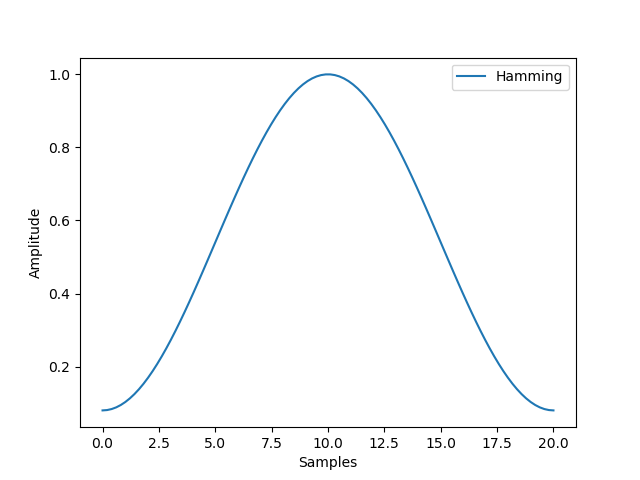
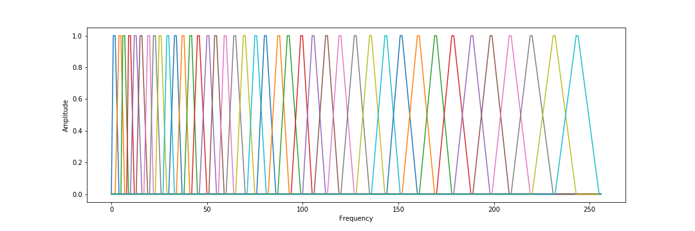

# Vocal Tract Length Normalization

Extraction of speech features from raw audio is the first step for any speech related application. Some speaker normalization techniques exist to reduce the sensibility of extracted features to speaker, thus focusing on speech content. Among them, vocal tract length normalization (VTLN) aims to compensate for the fact that speakers have vocal tracts of different sizes. 

This technique computes a learned factor for each speaker that is used to warp the frequency-axis of the spectra. The pipeline has the following steps : extract MFCC, extract VAD, train UBM model, train VTLN model, extract warp factor from trained VTLN model. 

(include audio)

## Mel-Frequency Cepstral Coefficients (MFCC)

### Framing
The first step is to compute the initial speech features. The audio signal is split into successives frames, each frame length is around 25 milliseconds with a shift of 10 milliseconds. The idea behind this step is that frequencies in a signal change over time, so it would not made sense to do a Fourier transform over the entire signal and instead we do a Fourier transform over each frame.

### Windowing
To reduce spectral leakage, it is needed to apply a [window function](https://en.wikipedia.org/wiki/Window_function#Spectral_analysis) to each frame. A standard window function is the Hamming window $$w$$, where for each frame $$0 \leq n \leq N-1$$ in the window of size $$N$$:

\\[w(n) = 0.54 - 0.46 \cos(2 \pi \frac{n}{N-1})\\]

> Hamming window

### Spectrogram, filter banks and MFCC
We then compute the [spectrogram](https://en.wikipedia.org/wiki/Spectrogram) by doing a short time FFT on each frame.

(include spectrogram)

The final step before being able to compute MFCCs is to apply triangular filters on a [mel scale](https://en.wikipedia.org/wiki/Mel_scale) to the power spectrum to extract frequency bands. A mel is a unit of measure based on the human ears perceived frequency. One of the formulas to convert $$f$$ hertz into $$m$$ mels is: 

\\[m = \frac{1000}{\log 2} \log (1+ \frac{f}{1000}) \\]

> Triangular filters

This gives us the [filter banks](https://en.wikipedia.org/wiki/Filter_bank)

(include filterbanks)

Finally, by taking the log of the spectrum, applying a [discret cosine transform](https://en.wikipedia.org/wiki/Discrete_cosine_transform) and by keeping the resulting cepstral coefficients 2-13 and discarding the rest, we get the [Mel-frequency Cepstral Coefficients](https://en.wikipedia.org/wiki/Mel-frequency_cepstrum).

(include mfcc)

### CMVN
Optionally, we can do Cepstral Mean Variance Normalization to those features to minimize noise contamination by transforming the coefficients to have the same statistics (mean 0, variance 1).

### Voice Activity Detection (VAD)
Before training the UBM and the VTLN model, we need to remove frames that do not contain speech using VAD. One of the common and easy way to do this is to use the energy-based VAD, and to remove all frames where the energy is below a given threshold.

## Train UBM

A Universal Background Model - Gaussian Mixtures Model (UBM-GMM) is a speaker-independant model using Gaussian mixtures to represent the distribution of features. 

It is trained on a large quantity of speech from a wide population; the parameters of the GMM are computed iteratively via [Expectation-maximization](https://en.wikipedia.org/wiki/Expectation%E2%80%93maximization_algorithm) (EM) algorithm.

## Train VTLN model
