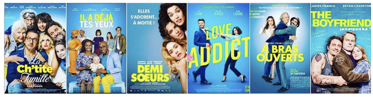
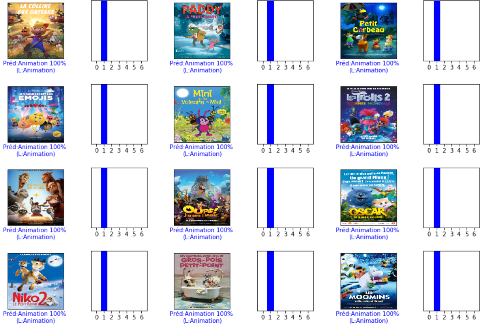
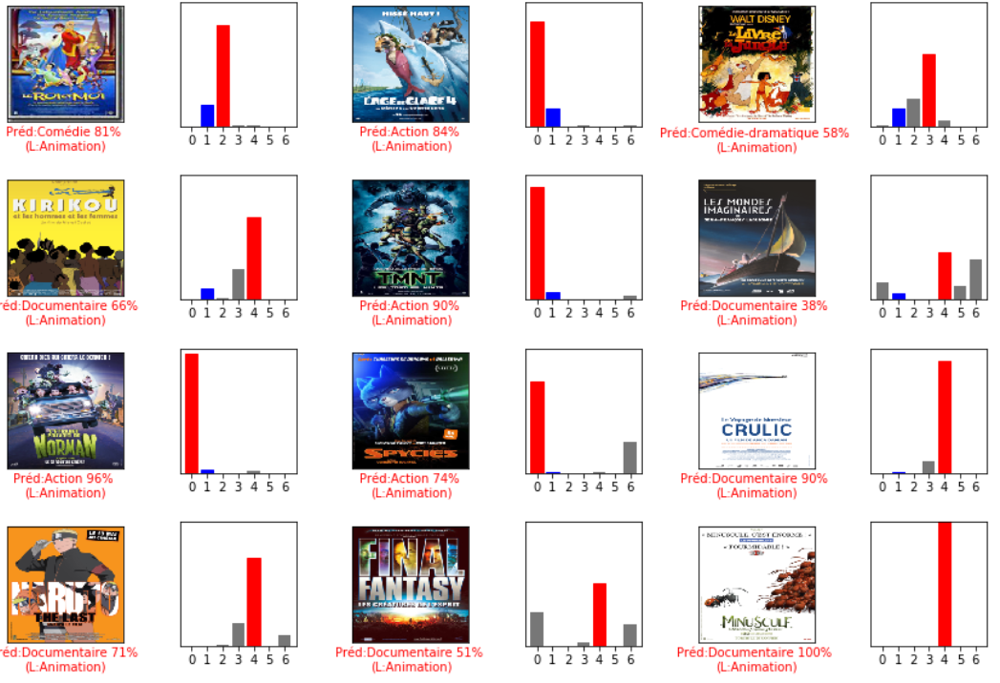
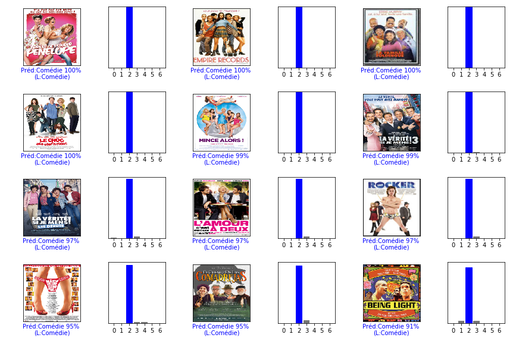

# Movie genre classification based on posters
In this project, I worked with other students from my department at the École des Ponts and with data scientists from **Warner Bros.** to build a model to classify movies according to their genre based on their poster.
Posters usually follow certain codes, and one can often guess the genre of a movie using only the poster.

> Some french posters of comedies

Given the database we had, we kept **7 genres** (Animation, Action, Comedy, Dramatic Comedy, Documentary, Drama, Thriller), with one unique genre per film. We had at the end 4900 posters evenly distributed. We used data augmentation to increase the diversity of the training set, by applying random transformations such as image rotation, cropping, or adjust the hue of images by a random factor.

The approach that turned out to work the best was to use a **ResNet-18** pre-trained on ImageNet and replace the layer used to give a prediction among the classes from ImageNet by a layer with an output of size 7 (our 7 genres).
We then trained only this layer on our training dataset by keeping the rest of the weights of the network frozen. When we saw that the performance stopped increasing, we fine-tuned the whole model by gradually unfreezing a few of the top layers.

In the end, we acheived a **0.45** global accuracy. What's interesting is the difference in performance according to the genre of the film.

> Confusion Matrix: for each true label, one can see the distribution of the predictions. The ideal matrix would be the identity matrix.

We can see that the model does really well for Animation (with a 0.8 accuracy), but has a hard time for Dramatic Comedy or Drama (both 0.26 accuracy). It is the same kind of behavior that for us; and if we look closely to the results on the testing set it is becoming clear where the model can make a mistake.

If we look at the Animation movies of the testing set that were predicted as such with the strongest confidence, we can easily see what makes a poster of an Animation movie.

However, the Animation movies that had the worst prediction would have been a lot harder for us to guess correctly, if it was not for the drawn aspect of the poster.

Especially because some of those posters borrow on purpose codes from other genres. It is the case for "TMNT" which takes the code of Action movies or for "Kirikou" (Documentary, with this lettering and these flat areas of color).

Similarly, the comedies with the strongest guess all respect the same codes for their poster:

But the comedies with the worst predictions are harder to guess for us too. "Free Guy" certainly borrow the codes of Action movies, "The One and Only Ivan" could be an Animation movie with the drawn gorilla on the poster, and "Reza" could easily be a documentary with this poster.

The same can be done for every genre, and this can explain a big part of the errors of the model. One also have to keep in mind that the genres of a movie are not as well defined as if an image is of a dog or a cat. Another approach could have been to do a multi label classification instead of mono label, and if you look up for similar projects it is often what is done. However, you need a larger dataset, and it is harder to determine what is expected from the model. Some movies have 3 genres, some just one. And how do you evaluate the results in that case ? We have not been able to explore these issues, and we chose to stick with the mono label classifcation, better suited for our database and the time we had for this project.

# Superpixels

  

In this project we implemented in C++ an image segmentation with superpixels technique. Image segmentation with superpixels allows for a great simplification of images while keeping their visual characteristics.

The core principle is to do a k-means clustering with a well chosen distance bewteen the pixels. The easiest way to do that is the SLIC (Simple Linear Image Clustering) method, for which the distance for the k-means algorithm is the sum of the spatial distance and the RGB (or LAB) distance multiplied by a chosen parameter.

A more sophisticated way to do such segmentation is with the SCALP (Super Pixels with Contour Adherence using Linear Path) method. It takes into account a contour map of the picture for higher visual accuracy in the segmentation, by sticking more to the countours.
<!--Rajouter les équations des distances, un peu plus de détails!-->

# Inpainting

  

In this project we implemented in C++ an image inpainting algorithm. This algorithm removes large objects from images, while filling the hole that is left behind in a visually plausible way by propagating texture and structure information simultaneously. The method we used is based on patch similarities within the image.
<!--Plus de détails!-->

